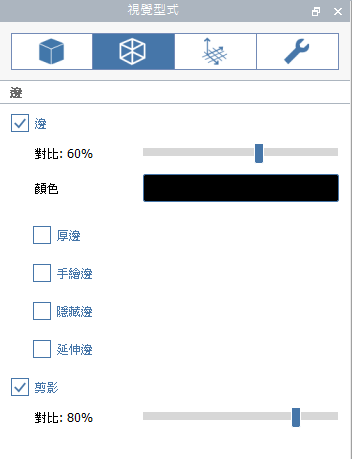

# 视觉样式

自定义模型的视觉外观，包括整体照明、边样式和环境效果。单击选项板栏中的太阳镜图标，即可找到“视觉样式”面板：

[可以按场景](https://windows.help.formit.autodesk.com/building-the-farnsworth-house/visual-settings)设置“视觉样式”，以便可以保存您喜欢的样式设置并将其应用于其他场景。

## 面

管理曲面的显示和着色方式。

.png>)

**“环境光亮度”** 控制场景中所有材质的总体亮度。值为 100 表示暴露在光线下的材质将以材质颜色或纹理中定义的全亮度显示。超过 100 的值会使材质过度曝光，但对于在 FormIt 中仍然看起来很暗的 SketchUp 模型可能有用。默认值为 100。

**“环境光对比度”** 控制与暴露在阳光直射下的面相比时，阴影中所显示面的较暗程度。值为 0 表示照明没有效果（无论方向如何，所有材质都将以其全亮度显示），而更高的值将使阴影中的面看起来越来越暗。默认值是 25。

切换 **“阴影”** ，以查看设计[在一天中的当前时间如何着色](https://windows.help.formit.autodesk.com/v/simplified-chinese/tool-library/shadows)。

**“阴影强度”** 控制在地平面和其他面上绘制阴影的暗黑程度。值为 0 将使阴影完全不可见，值为 100 将使阴影变为黑色。默认值是 20。

**“环境光阴影”** 为角点添加一点阴影，以增加 FormIt 模型的真实感。

**“单调曲面”** 禁用所有材质的颜色和纹理，并使周围环境变为白色。对阴影或着色分析很有用。

“曲面颜色”部分定义未应用材质时面的默认颜色。

**“面”** 是未应用任何材质时所有正面 FormIt 面的默认颜色（或两侧，如果未选中“背面”）。

对于输入到 FormIt 并需要使用此选项的 SketchUp 模型，**“背面”** 用于在单个面的任一侧显示不同的材质。此选项默认处于取消选中状态，但在打开或输入 SketchUp 模型时会处于选中状态。在非 SketchUp 几何图形中，指定的“背面”颜色将显示在面的背面。

使用[“剖面平面”](section-planes.md)工具时，“剖面剖切效果”和“剖面土层效果”部分用于管理面、线和土层效果的默认颜色。

### 边

管理模型中所有边的显示样式。

**“对比度”** 影响所有边的可见性。值为 0 将使边完全不可见。默认值为 60。

**“颜色”** 影响模型中所有边的颜色。默认颜色为黑色。

**“厚边”** 使所有边变厚，包括轮廓边。

**“勾绘边”** 向所有边添加勾绘效果，以模拟手绘效果。

**“隐藏边”** 显示遭曲面遮挡的边。

**“延伸边”** 为某些边添加延伸，以模拟手绘效果。

## 环境

切换环境效果和辅助对象的显示。

**“栅格”** 控制显示地平面上的栅格以及编辑组时显示的栅格。禁用“栅格”时，将禁用“捕捉到栅格”选项。

**“轴”** 控制显示世界原点处或组原点处（编辑组时）所显示的 XYZ 轴。

**“标高”** 控制显示在“标高”面板所设置的 [**“标高”**](levels-and-area.md) 。

**“雾”** 控制雾的显示，绘制雾是为了使地平面和天空之间的过渡看起来无缝。禁用“雾”将导致地平面（如果启用）与天空相交处出现硬地平线。

**“北向箭头”** 控制指示项目北向（由位置和卫星图像确定）的小图形控件的显示。

还可以自定义环境颜色，如天空、背景和地平面。

天空由 **“下/背景”** 、 **“中”** 和 **“上”** 颜色的渐变组成。

如果未选中 **“天空”** 选项，则仅 **“下/背景”** 颜色可见。

使用滑块控制**地平面**透明度。

在“组编辑模式”下禁用“地平面”时，蓝色的“工作平面”栅格现在也处于禁用状态。

还可以从“视觉样式”面板自定义**工作平面**的颜色。

## 诊断

切换诊断工具的显示。

**“无间隙问题”** 以红色亮显不属于无间隙实体对象的所有边。

**“背面”** 以红色亮显朝向错误的方向的所有面（所有实体对象的背面都应朝向实体形状的内部）。

[详细了解如何使用“无间隙”和“背面”诊断来确定和修复实体模型的问题](https://formit.autodesk.com/blog/post/repairing-solid-models)。
