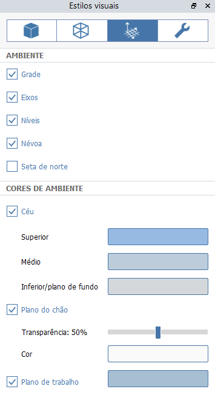
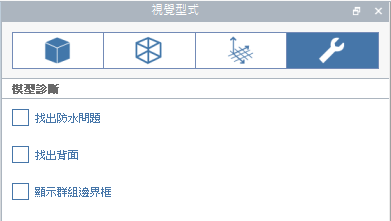

# Styles visuels

Personnalisez l’apparence visuelle de votre modèle, notamment l’éclairage global, les styles d’arêtes et les effets d’environnement. Pour accéder au groupe de fonctions Styles visuels, cliquez sur l’icône représentant des lunettes de soleil dans la barre de la palette :

Les styles visuels [peuvent être définis par scène](https://windows.help.formit.autodesk.com/building-the-farnsworth-house/visual-settings), ce qui vous permet d’enregistrer vos paramètres de style favoris et de les appliquer à d’autres scènes.

## Surfaces

Gérez la façon dont les surfaces sont affichées et ombrées.

.png>)

L’option **Luminosité ambiante** contrôle la luminosité globale de tous les matériaux de la scène. Une valeur de 100 signifie que les matériaux exposés à la lumière s’afficheront avec toute leur luminosité, comme définie dans la couleur ou la texture du matériau. Les valeurs supérieures à 100 exposent trop les matériaux, mais peuvent être utiles pour les modèles SketchUp qui semblent encore sombres dans FormIt. La valeur par défaut est de 100.

L’option **Contraste ambiant** détermine l’intensité de l’ombre des faces sombres par rapport aux faces exposées à la lumière directe du soleil. Une valeur de 0 signifie que l’éclairage n’a aucun effet (tous les matériaux apparaîtront avec leur luminosité totale quelle que soit leur orientation), tandis que des valeurs plus élevées assombrissent de plus en plus les faces ombrées. La valeur par défaut est 25.

Activez/désactivez l’option **Ombres** pour découvrir comment votre conception serait [ombrée à l’heure actuelle](https://windows.help.formit.autodesk.com/v/french/tool-library/shadows).

L’option **Intensité de l’ombre** détermine la façon dont les ombres sombres sont tracées sur le plan du sol et sur d’autres faces. Une valeur de 0 rend les ombres invisibles et une valeur de 100 rend les ombres noires. La valeur par défaut est de 20.

L’option **Ombres ambiantes** ajoute une touche d’ombrage aux coins pour ajouter du réalisme à votre modèle FormIt.

L’option **Surfaces monotones** désactive la couleur et la texture de tous les matériaux et rend l’environnement blanc. Elle est utile pour les études d’ombres ou d’ombrage.

La section Couleurs de surface définit les couleurs par défaut des faces lorsqu’aucun matériau n’est appliqué.

L’option **Faces** est la couleur par défaut de toutes les faces avant de FormIt (ou des deux côtés, si l’option Faces arrière est désactivée) lorsqu’aucun matériau n’est appliqué.

L’option **Faces arrière** permet d’afficher différents matériaux de chaque côté d’une face unique pour les modèles SketchUp importés dans FormIt et qui en ont besoin. Cette option est désactivée par défaut, mais elle est activée lorsque des modèles SketchUp sont ouverts ou importés. Dans une géométrie autre que SketchUp, la couleur de la face arrière spécifiée s’affiche sur les côtés arrière des faces.

Utilisez les sections Effets de coupe et Effets de pochage de coupe pour gérer les couleurs par défaut des faces, des lignes et l’effet de pochage lorsque l’outil [Plan de coupe](section-planes.md) est utilisé.

### Arêtes

Gérez le style d’affichage de toutes les arêtes du modèle.

L’option **Contraste** affecte la visibilité de toutes les arêtes. Une valeur de 0 rend les arêtes invisibles. La valeur par défaut est 60.

L’option **Couleur** affecte la couleur de toutes les arêtes du modèle. La valeur par défaut est le noir.

L’option **Arêtes épaisses** permet d’épaissir toutes les arêtes, y compris les arêtes de silhouette.

L’option **Arêtes d’esquisse** ajoute un effet d’esquisse à toutes les arêtes, afin de simuler un effet de dessin à main levée.

L’option **Arêtes masquées** affiche les arêtes masquées par les surfaces.

L’option **Arêtes étendues** ajoute une extension à certaines arêtes pour simuler un effet de dessin à main levée.

## Environnement

Activez ou désactivez l’affichage des effets d’environnement et des objets assistants.

L’option **Grille** contrôle l’affichage de la grille sur le plan du sol, ainsi que la grille affichée lors de la modification d’un groupe. L’option « Accrocher à la grille » est désactivée lorsque la grille est désactivée.

L’option **Axes** contrôle l’affichage des axes XYZ qui s’affichent à l’origine universelle ou à l’origine du groupe en cas de modification d’un groupe.

L’option **Niveaux** contrôle l’affichage des [**niveaux**](levels-and-area.md) définis dans le groupe de fonctions Niveaux.

L’option **Brouillard** contrôle l’affichage du brouillard dessiné afin de créer une transition homogène entre le plan du sol et le ciel. Si vous désactivez cette option, une ligne d’horizon continue apparaît à l’endroit où le plan du sol (si activé) rencontre le ciel.

L’option **Flèche nord** contrôle l’affichage d’un petit widget graphique qui indique la direction du nord du projet (déterminée par l’emplacement et l’image satellite).

Les couleurs d’environnement, telles que le ciel, l’arrière-plan et le plan du sol, peuvent également être personnalisées.

Le ciel est constitué d’un dégradé de couleurs **Inférieur/arrière-plan**, **Milieu** et **Supérieur**.

Si l’option **Ciel** est désactivée, seule la couleur **Inférieur/arrière-plan** est visible.

Contrôlez la transparence du **plan du sol** à l’aide du curseur.

Lorsque le plan du sol est désactivé en mode de modification de groupe, la grille du plan de construction bleu est également désactivée.

La couleur du **plan de construction** peut également être personnalisée à partir du groupe de fonctions Styles visuels.

## Diagnostics

Activez ou désactivez l’affichage des outils de diagnostic.

L’option **Identifier les problèmes d’étanchéité** surligne en rouge toutes les arêtes qui ne font pas partie d’un objet solide étanche.

L’option **Faces arrière** surligne en rouge toutes les faces qui sont orientées dans la mauvaise direction (les faces arrière de tous les objets solides doivent être orientées vers l’intérieur de la forme solide).

[En savoir plus sur l’utilisation des diagnostics d’étanchéité et de faces arrière afin d’identifier et de corriger les problèmes liés aux modèles solides](https://formit.autodesk.com/blog/post/repairing-solid-models).
