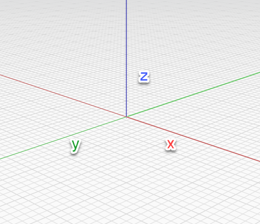

# 世界轴

可以通过更改世界轴来修改默认坐标系和栅格。

## 使用轴绘制和建模

在 FormIt 中打开空白草图时，世界轴将在屏幕中心显示为三条红、绿和蓝线。这三条线定义用于定义三维世界的三个笛卡尔方向。“X”方向由红线定义、“Y”方向由绿线定义、“Z”或“向上”方向由蓝线定义。

要旋转栅格并重新定义草图的原点，请在场景中的空白区域上**单击鼠标右键**，然后从上下文菜单中选择 **“设置轴(SZ)”** 图标 \
.png>) 

将显示“设置轴”控件。单击中心的大夹点，以选取控件。再次单击以设置原点。现在，单击红色轴上的点以旋转栅格，或者单击蓝色轴上的点以垂直旋转栅格平面。在空白处单击关闭，以确认更改\

要将原点和栅格**重置**回默认设置，请在场景中的空白区域上单击鼠标右键，然后选择 **“重置轴(RZ)”**

## 世界轴和局部轴

上述步骤介绍了如何控制草图的**全局坐标系**。开始使用[**组**](groups.md)时，可以从整个草图中唯一地控制该组的**局部坐标系**。编辑组时，可以按照上述相同步骤编辑局部坐标系，但这些更改将仅应用于该组

## 与轴交互

* 当使用草图工具时将显示**红色、绿色和蓝色轴**，以指导三维草图绘制
* **紫色轴**显示相对于以一定角度绘制的线的垂直轴和平行轴
* 在绘制草图或移动时按住 **Shift 键**，以**锁定到当前轴**
